# syntext

[](https://github.com/whit3rabbit/syntext/actions/workflows/ci.yml)
[](https://crates.io/crates/syntext)
[](https://docs.rs/syntext)
[](LICENSE)

**A faster grep for agentic AI. ~20X Faster than Ripgrep when indexed**

This is largely based on information derivied from this [Cursor Blog Post](https://cursor.com/blog/fast-regex-search) and [GitHub Code Search](https://github.com/features/code-search).

A hybrid code search index for agent workflows, built in Rust. Indexes repositories using sparse n-grams with a pre-trained frequency weight table, then narrows to a small candidate set before verification. Designed as a drop-in replacement for `rg` in AI agent loops where grep is called repeatedly and in parallel.

**Status: stable (v1.0).** See [Project status](#project-status) below.

## Installation

### macOS (Homebrew)

Homebrew casks are published in [whit3rabbit/homebrew-tap](https://github.com/whit3rabbit/homebrew-tap).

```bash
brew tap whit3rabbit/tap
brew install --cask whit3rabbit/tap/syntext
```

### Linux

Download release artifacts from the [GitHub releases page](https://github.com/whit3rabbit/syntext/releases).

```bash
VERSION=1.0.0

# Debian/Ubuntu
curl -L "https://github.com/whit3rabbit/syntext/releases/download/v${VERSION}/syntext_${VERSION}_amd64.deb" -o "syntext_${VERSION}_amd64.deb"
sudo dpkg -i "syntext_${VERSION}_amd64.deb"

# Any Linux (x86_64)
curl -L "https://github.com/whit3rabbit/syntext/releases/download/v${VERSION}/st-${VERSION}-linux-amd64" -o st
chmod +x st && sudo mv st /usr/local/bin/
```

### From source

```bash
cargo install syntext
```

## Why this exists

AI coding agents call grep dozens of times per task. On large monorepos, each `rg` invocation touches every file. Those calls compound into significant stalled agent time per coding session.

syntext builds a content index so queries only touch candidate files, not all files. The verifier confirms matches against actual file content, so results are correct (identical to ripgrep).

## Benchmarks

Real-world benchmark runs are tracked in
[docs/BENCHMARKS.md](docs/BENCHMARKS.md). The table below is
the current 2026-03-29 snapshot from preset-backed external runs using the
shared harness `scripts/bench_compare.py`.

### Search latency

The chart uses the mean latency across each preset's exact-count queries. It
compares the two tools that ran on every preset. `grep` is listed in the table
below, but the Linux preset intentionally skips it.

```mermaid
xychart-beta
    title "External preset search latency (ms, lower is better)"
    x-axis ["React", "Rust", "TypeScript", "Node", "Linux"]
    y-axis "Milliseconds" 0 --> 4000
    bar "syntext" [21, 100, 112, 70, 155]
    bar "rg" [113, 2183, 3094, 1493, 3681]
```



| Repo | `syntext` avg | `rg` avg | `grep` avg | Speedup vs `rg` |
|---|---:|---:|---:|---:|
| React | `20.7 ms` | `112.9 ms` | `314.3 ms` | `5.5x` |
| Rust compiler | `99.9 ms` | `2183.2 ms` | `2412.8 ms` | `21.9x` |
| TypeScript | `111.9 ms` | `3093.8 ms` | `3171.8 ms` | `27.7x` |
| Node.js | `69.5 ms` | `1492.6 ms` | `3186.4 ms` | `21.5x` |
| Linux kernel | `154.5 ms` | `3681.3 ms` | `n/a` | `23.8x` |

Method:

- **Note**: These benchmarks were run against `syntext` version `1.0.0`.
- External repos use the same harness and preset catalog.
- The chart and table use arithmetic means across each preset's exact-count queries.
- Times are single-run preset medians on macOS unless noted otherwise.
- `syntext` search time excludes index build time. Build time is shown separately.
- Linux uses the cheaper shared large-corpus mode (`syntext` + `rg`) because the
  full three-tool run is too expensive on the benchmark machine.

Notes:

- Latency grows roughly with repo size for scan tools, while `syntext` stays under `155 ms` on every preset in this matrix.
- The exact-count validated preset terms are documented in
  [docs/BENCHMARKS.md](docs/BENCHMARKS.md).
- This refreshed matrix covers React, Rust, TypeScript, Node.js, and Linux.
- Every query in the 2026-03-29 matrix matched the comparator tool counts.
- Substring-heavy terms such as `ReactElement`, `useEffect`, and `TyCtxt` are
  intentionally not in the headline README table because they can undercount in
  `syntext` relative to `rg`.
- Historical and exploratory runs, including mismatched-count investigations,
  remain in [docs/BENCHMARKS.md](docs/BENCHMARKS.md).

### Performance Summary

In indexed search scenarios, `syntext` materially outperforms `rg` by shrinking
the candidate set before verification.

- Average speedup across the five presets above: `20.1x` versus `rg`.
- Worst case in this matrix is still `5.5x` faster than `rg` on React.
- Largest corpus in this matrix, the Linux kernel, still averaged `154.5 ms`.

### Index build time

| Repo | Preset | Tracked files | Tools | `st index` |
|---|---|---:|---|---:|
| React | `react_token_aligned` | 6,840 | `syntext`, `rg`, `grep` | `746.003 ms` |
| Rust compiler | `rust_token_aligned` | 58,698 | `syntext`, `rg`, `grep` | `3376.174 ms` |
| TypeScript | `typescript_compiler` | 81,362 | `syntext`, `rg`, `grep` | `4807.992 ms` |
| Node.js | `node_runtime` | 47,364 | `syntext`, `rg`, `grep` | `3991.465 ms` |
| Linux kernel | `linux_token_aligned` | 93,018 | `syntext`, `rg` | `8357.722 ms` |


## Usage

### CLI

```bash
# Build the index
st index --stats

# Search the whole repo
st "fn parse_query"                 # regex
st -F "parse_query("                # literal (metacharacters stay literal)
st -i "parsequery"                  # case-insensitive
st -x "TODO"                        # whole-line match
st -n "impl.*Iterator"              # force line numbers

# Restrict search scope with positional paths
st "needle" src/                    # search one directory
st "needle" src/lib.rs              # search one file
st "needle" src/lib.rs tests/       # search multiple files/directories

# Additional filters and output modes
st -t rs "impl.*Iterator"           # restrict to Rust files
st -g "src/" "TODO"                 # restrict by glob
st -c "parse_query" src/lib.rs      # count matches in one file
st -l "parse_query"                 # print matching file paths
st --json "TODO"                    # NDJSON output for tooling

# Incremental update after edits
st update

# Status
st status
```

Notes:

- Search is the default command, there is no `st search` subcommand.
- Like ripgrep, file names are shown by default when searching a directory, the whole repo, or multiple positional paths.
- Like ripgrep, line numbers are off by default when stdout is not a TTY. Use `-n` to force them on.

### Library

```rust
use syntext::{Config, Index, SearchOptions};

let config = Config {
    repo_root: "/path/to/repo".into(),
    index_dir: "/path/to/repo/.syntext".into(),
    ..Config::default()
};

let index = Index::open(config)?;
index.build()?;

// Search
let results = index.search("fn parse_query", &SearchOptions::default())?;

// Agent workflow: edit files, then search
index.notify_change(Path::new("src/foo.rs"))?;
index.notify_change(Path::new("src/bar.rs"))?;
index.commit_batch()?;  // atomic visibility
let fresh_results = index.search("new_function", &SearchOptions::default())?;
```

## WASM / Browser / Node.js

The `wasm` Cargo feature compiles syntext to a fully in-memory index with no filesystem access. Files are provided by the caller as a JS object mapping paths to `Uint8Array` content.

### Build from source

```bash
cargo install wasm-pack
wasm-pack build --target bundler -- --features wasm --no-default-features
# output: pkg/  (JS glue + .wasm + TypeScript types)
```

Alternatively, download `syntext-wasm-<version>.tar.gz` from the [releases page](https://github.com/whit3rabbit/syntext/releases).

### Usage

```js
import init, { WasmIndex } from "./syntext_bg.js";

await init();

const enc = new TextEncoder();
const idx = new WasmIndex({
  "src/lib.rs": enc.encode("pub fn build_index() {}"),
  "src/main.rs": enc.encode('fn main() { println!("hello"); }'),
});

const matches = idx.search("build_index");
// [{path: "src/lib.rs", line_number: 1, line_content: "pub fn build_index() {}",
//   submatch_start: 7, submatch_end: 18}]
```

The `WasmIndex` constructor indexes everything up front; `search()` is synchronous and can be called repeatedly. Accepts any pattern that the native `st` CLI accepts (literal, regex, `-F` flag behavior is not exposed at the WASM level).

## Weight table

`src/tokenizer/weights.rs` is a pre-trained `[u16; 65536]` byte-pair frequency table. Rare pairs get high weights (gram boundaries), common pairs get low weights (gram interiors).

Two generation paths:

| Script | Corpus | When to use |
|---|---|---|
| `scripts/weights_gen.py` | ~175 MB from `bigcode/the-stack-smol` (default) | Local regeneration, CI |
| `scripts/notebooks/weights_gen_colab.ipynb` | 100 GB – 500 GB+ from `bigcode/the-stack-dedup` | Higher quality, run on Colab Pro |

The current shipped table was trained on ~498 GB across 20+ languages (49.7% pair
coverage, 32,542 / 65,536 non-zero pairs). The Colab notebook uses bulk Parquet
download with checkpointing after every shard (safe against disconnects) and emits
a `weights.rs` ready to drop into `src/tokenizer/`. HuggingFace access required
for `the-stack-dedup`.

## Architecture

For the full quantitative analysis (selectivity math, index size estimates, posting list encoding tradeoffs), see **[docs/ARCHITECTURE.md](docs/ARCHITECTURE.md)**.

The high-level flow:

```
Query -> Router -> [Literal | Indexed Regex | Full Scan]
                        |
                   Gram extraction
                        |
                   Posting list intersection (smallest-first)
                        |
                   Candidate file IDs
                        |
                   Verifier (memchr or regex against file content)
                        |
                   Results
```

Three index components feed candidate selection:

- **Content index**: sparse n-gram posting lists (the core). Trigram augmentation ensures no false negatives for token-aligned queries.
- **Path index**: Roaring bitmap component sets for path/type filtering.
- **Symbol index** (optional): Tree-sitter extraction into SQLite.

Segments are immutable single-file mmap structures (SNTX format). Updates go through an in-memory overlay with atomic batch commit via `ArcSwap`.

## Project status

**All phases complete (v1.0).** The core `st index && st search "pattern"` workflow is functional and validated against ripgrep. Symbol search is available behind `--features symbols`.

See `specs/001-hybrid-code-search-index/tasks.md` for the full implementation plan with 69 tasks across 9 phases.

| Phase | Status | What it delivers |
|---|---|---|
| 1. Setup | Complete | Cargo project, dependencies, module structure |
| 2. Foundational | Complete | Weight table, tokenizer, posting lists, correctness harness |
| 3. US5 -- Build | Complete | Full index build from scratch |
| 4. US1 -- Search | Complete | Literal + regex search, ripgrep correctness validation |
| 5. US2 -- Incremental | Complete | Overlay, batch commit, read-your-writes |
| 6. US3 -- Path scoping | Complete | Path/type filters with Roaring bitmaps |
| 7. US4 -- Symbols | Complete | Tree-sitter symbol extraction, SQLite storage |
| 8. CLI | Complete | `st` binary with grep-compatible output |
| 9. Polish | Complete | Bug fixes, security hardening, benchmarks, documentation |

## Known limitations

1. **Crash recovery**: Overlay state is lost on unclean shutdown. Run `st update` or `st index` after a crash.
2. **Invert match scope**: `st -v` inverts within candidate files only, not the full corpus.
3. **Non-aligned substring coverage**: ~16% false-negative rate for queries that don't align with token boundaries. Token-aligned queries (identifiers, keywords) have 0% false negatives.
4. **Network filesystems**: Index directory must be on local filesystem. NFS/SMB behavior is undefined.
5. **Case-insensitive overhead**: ~15-20% more candidates due to lowercase normalization. Correct results guaranteed by verifier.
6. **`\r`-only line endings**: Treated as a single line (matches ripgrep behavior).
7. **Symbol search accuracy**: Tier 3 (heuristic) results are approximate. Tree-sitter failures fall back silently.

## Design documents

- **[docs/ARCHITECTURE.md](docs/ARCHITECTURE.md)** -- Quantitative analysis: selectivity math, index size estimates, posting list encoding, design tradeoffs
Detailed specs in `specs/001-hybrid-code-search-index/`:

- **[spec.md](specs/001-hybrid-code-search-index/spec.md)** -- Feature specification with user stories and acceptance criteria
- **[research.md](specs/001-hybrid-code-search-index/research.md)** -- 19-section architecture research covering every subsystem
- **[data-model.md](specs/001-hybrid-code-search-index/data-model.md)** -- Entity definitions and relationships
- **[contracts/](specs/001-hybrid-code-search-index/contracts/)** -- Library API, CLI, and segment format contracts
- **[tasks.md](specs/001-hybrid-code-search-index/tasks.md)** -- Implementation plan with dependency graph

## License

MIT
