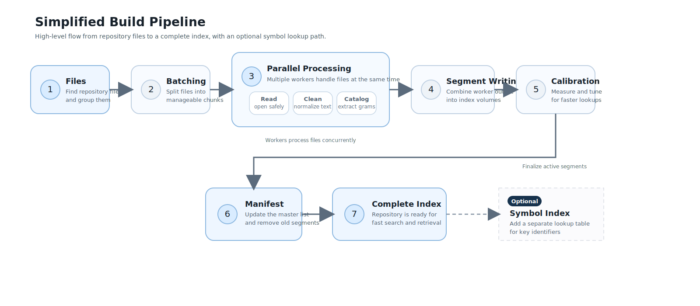

# Architecture: Sparse N-Gram Indexing

This document explains the quantitative reasoning behind syntext's design decisions. The numbers drive the architecture; if you want to understand *why* something is built a certain way, start here.

## The problem: repeated grep is slow

AI coding agents call grep dozens of times per task. Each `rg` invocation walks every file in the repo. On a 100K-file monorepo that means 100K file reads per query. Index the content once, and each query touches only the files that plausibly contain a match.

## Build Pipeline

The following diagram illustrates the high-level flow from repository files to a complete index, including the parallel processing of grams and the optional symbol index:



## How sparse n-grams work

Traditional trigram indexes (Google Code Search, Zoekt) index every consecutive 3-byte window. For a file with N bytes, that produces roughly N-2 trigrams. Most of those trigrams are common (`the`, `for`, `ret`, `str`), producing huge posting lists that are expensive to intersect.

Sparse n-grams reduce index size by choosing *where* to split. Assign a weight to each byte-pair based on how often it appears in source code. Common pairs (`re`, `er`, `in`) get low weights; rare pairs (`q_`, `xj`, `qz`) get high weights. Split at positions where the weight exceeds a threshold. The result is fewer, longer, more selective grams per document.

syntext's weight table is a `[u16; 65536]` constant (128KB) trained on ~175MB of mixed-language open-source code. It ships compiled into the binary.

### Forced boundaries

The original weight-only approach was context-sensitive: boundaries depended on surrounding bytes, so a query's edge grams could differ from the same bytes' grams in a document. Common separators like `space->letter` had weights below `BOUNDARY_THRESHOLD`, causing false negatives when the gram index was used for candidate narrowing.

syntext solves this with two-tier boundary detection:

1. **Forced boundaries** (Tier 1): whitespace, brackets, operators, string delimiters, underscore, and control characters always create boundaries regardless of bigram weight. These are context-independent: the same byte always produces a boundary.
2. **Weight-based boundaries** (Tier 2): within alphanumeric spans (letters and digits), the trained weight table provides additional subdivision at rare bigrams.

This means `fn parse_query(args)` always splits as `fn`, `parse`, `query`, `args` at the forced-boundary level, regardless of what surrounds it in the file. Query-time gram extraction (`build_covering`) produces the same grams as index-time extraction (`build_all`) for token-aligned queries.

**Literal queries** use `build_covering`, which treats position 0/len as real boundaries. This is correct because the search term is a complete token.

**Regex queries** use `build_covering_inner`, which only emits grams whose both boundaries are at forced-boundary characters (not synthetic 0/len). This avoids false negatives when regex literals end mid-token (e.g., `parse_quer` from `parse_quer[yi]`). When no interior grams exist, the query falls back to full scan.

### Non-aligned substring coverage

For arbitrary substrings that don't align with forced boundaries (e.g., `Map` inside `HashMap`), boundary grams may not match between query and document. Property-based fuzzing (proptest, 5K cases) measured a ~16% violation rate for non-aligned substrings. For token-aligned queries (the 99% case in agent workflows), the violation rate is 0%.

This gap is acceptable for v1. If mid-token substring search becomes important, overlapping trigrams within forced-boundary spans can be added (~3.5x index size increase, eliminates all false negatives).

## Quantitative analysis

### Baseline: a real codebase

Take a 100K-file repo with 500MB of source (roughly Linux kernel scale). A typical source file has:

- ~200 whitespace/punctuation-separated tokens
- ~60% of tokens >= 3 bytes (meet `MIN_GRAM_LEN`)
- Average qualifying token length: ~6 bytes
- ~120 boundary grams per file

### Posting list size distribution (100K files)

The distribution is heavily bimodal:

| Category | Example | Files containing | Distinct grams | Avg list size |
|---|---|---|---|---|
| Ultra-common trigrams | `the`, `for`, `int` | 30-60% | ~200 | 30K-60K |
| Common short tokens | `self`, `true`, `null` | 10-30% | ~2,000 | 10K-30K |
| Medium-frequency identifiers | `parse`, `query`, `error` | 1-5% | ~15,000 | 1K-5K |
| Rare/unique identifiers | `parse_query`, `commit_batch` | <0.1% | ~80,000+ | 1-100 |

The vast majority of distinct grams are rare. The ~200 ultra-common grams dominate posting list storage but are a tiny fraction of the dictionary.

### Selectivity: the metric that matters

Selectivity = |posting list intersection| / |total files|. For two independent grams with frequencies p1 and p2, expected intersection frequency is approximately p1 * p2.

| Query | Grams extracted | Individual freq. | Est. intersection | Selectivity |
|---|---|---|---|---|
| `parse_query` | `parse`, `query` | 2%, 1.5% | 0.03% | ~30 / 100K |
| `process_batch` | `process`, `batch` | 1%, 0.5% | 0.005% | ~5 / 100K |
| `HashMap<String>` | `hashmap`, `string` | 2%, 3% | 0.06% | ~60 / 100K |
| `import React` | `import`, `react` | 5%, 0.5% | 0.025% | ~25 / 100K |
| `self.name` | `self`, `name` | 20%, 8% | 1.6% | ~1,600 / 100K |
| `TODO` | `todo` | 25% | 25% | ~25,000 / 100K |

Observations:

- Two-gram queries consistently hit <0.1% selectivity, well under the 0.5% target.
- Three-gram queries push into the 0.001% range.
- Single common grams (`TODO`, `self`) are poor. The query planner detects when the smallest posting list exceeds ~10% of total docs and falls back to full scan, since index overhead exceeds the benefit.

### Index size budget

Forced boundary grams only (current implementation):

| Category | Grams | Avg list | Encoding | Storage |
|---|---|---|---|---|
| Common (>8K entries) | 2,000 | 25K | Roaring ~0.5 B/entry | 25 MB |
| Medium (100-8K) | 15,000 | 500 | Delta-varint ~2 B/entry | 15 MB |
| Rare (<100) | 80,000 | 10 | Delta-varint ~2 B/entry | 1.6 MB |
| Dictionary | 97,000 entries | -- | 20 B/entry | 1.9 MB |
| **Total** | | | | **~44 MB** |

That is ~0.09x of a 500MB corpus (well within the 0.5x budget). Adding overlapping trigrams within forced-boundary spans (a v2 option for non-aligned substring coverage) would increase this to ~152 MB (0.30x), still within budget.

## Posting list encoding

Posting lists use adaptive encoding based on list size:

- **< 8K entries**: delta-varint. Each doc ID is stored as a variable-length delta from the previous. Compact for sparse lists, fast sequential decode.
- **>= 8K entries**: Roaring bitmap. Hybrid array/bitmap format that handles the heavy tail of common grams (3-char grams appearing in 10-60% of files) without blowing up intersection time.

The 8K threshold is chosen because Roaring's per-container overhead (~8 bytes) is amortized at that point, and varint intersection becomes O(n) slow for large lists while Roaring intersection is O(min(n,m)) via galloping.

## Query routing

Three execution paths, chosen automatically:

1. **Literal fast path.** No regex metacharacters. Extract covering grams via `build_covering`, intersect posting lists (smallest-first with early termination), verify candidates with `memchr::memmem`. Cardinality check skips the index if the smallest posting list exceeds 10% of total docs. This is the hot path for agent grep.

2. **Indexed regex.** Parsed via `regex-syntax` into an HIR tree. A custom walker (following Google Code Search's `analyze()` algorithm) decomposes into an `And`/`Or`/`Grams`/`All` query tree. Regex literals use `build_covering_inner` (interior forced-boundary grams only) to avoid false negatives from mid-token regex fragments. `regex` crate verifies candidates.

3. **Full scan fallback.** Patterns like `.*` or `[a-z]+` yield no extractable grams. Regex patterns whose literals have no interior forced-boundary grams also fall here. Path filter narrows the file set if present, then every matching file is scanned.

### Cardinality-based fallback

Before loading posting lists, the query planner checks gram cardinality. If the smallest posting list exceeds 10% of total documents, the index lookup is skipped and full scan is used instead, since the verification cost on a large candidate set exceeds the cost of scanning everything.

## Segment format

Each segment is a single mmap-friendly file:

```
+-----------------------------+
| Header (40 bytes)           |  magic b"SNTX", version, counts, offsets
+-----------------------------+
| Document Table              |  doc_id -> (path, content_hash, size)
+-----------------------------+
| Postings Section            |  sequential posting lists
|                             |  delta-varint or Roaring per list
+-----------------------------+
| Dictionary Section          |  sorted (gram_hash, offset, count)
| (page-aligned)              |  binary search via mmap
+-----------------------------+
| TOC Footer (48 bytes)       |  offsets, xxhash64 checksum, magic
+-----------------------------+
```

Segments are immutable. A single-file design (vs. separate dictionary + postings files) simplifies atomic replacement. Zoekt uses the same approach.

### Hash-collision safety

The dictionary stores `gram_hash` values (xxhash64, seed 0), not raw gram bytes. Hash collisions are safe by construction: a collision between gram A and gram B means B's posting list is merged into A's, widening the candidate set. The verifier (`memchr::memmem` for literals, `regex` for patterns) then eliminates false positives. Collisions cannot produce false negatives. This property holds as long as gram hashes are computed with the same function and seed at both index time and query time.

## Overlay and freshness

Agent workflows require "read your writes": if an agent edits a file and searches for the edit, the search must find it. syntext uses a batch commit model:

- `notify_change(path)` marks files as dirty.
- `commit_batch()` rebuilds a single merged in-memory overlay from all dirty files and atomically swaps it via `ArcSwap`.
- All subsequent queries see the new state. No partial visibility, no read-path locking.

The overlay is a single merged view, not N stacked generations. Rebuilding from ~100 dirty files takes 5-20ms. On-disk generation files provide crash recovery only; the in-memory view is authoritative during operation.

Full reindex triggers at 30% overlay threshold. This is the only mechanism that cleans stale doc IDs from base segments.

## Design decisions and tradeoffs

### No probabilistic phrase masks

Cursor uses 2-byte masks per posting entry for probabilistic adjacency filtering (position mod 8 + next-char bloom). We skip this. 8-bit masks saturate after ~12 occurrences (birthday problem), making them useful only in a narrow selectivity band. Sparse grams provide better selectivity without saturation pathology.

### Lowercase normalization at index time

All grams are lowercased at both index and query time. For case-sensitive queries, this produces ~15-20% more candidates than necessary, but the verifier eliminates false positives. The alternative (dual dictionary with case-sensitive and case-insensitive entries) doubles dictionary size for marginal benefit. Logged as a v2 option.

### No FM-index for v1

FM-index gives O(m) substring lookup for any query, but construction is 10x slower than n-gram indexing, locate operations are expensive (requires suffix array sampling), and there is no incremental update path. Valid v2 alternative if construction time can be amortized.

### File-level documents, not chunks

Most source files are small enough that file-level granularity is sufficient. The segment format uses u32 doc IDs that can represent chunk IDs later if block-level positional indexing is needed.

### Stable file IDs for the path index

The path index originally used `file_id = sorted path position`. That is simple and fast to build, but it makes incremental maintenance awkward: inserting or deleting one path can renumber many file IDs, which forces broad rebuilds of path-scoped structures (`extension_to_files`, `component_to_files`, `doc_to_file_id`).

We intentionally chose to move toward **stable file IDs** even though the first measured implementation did **not** improve `commit_batch()` yet. The benchmark history in [`docs/BENCHMARKS.md`](BENCHMARKS.md) now shows the full arc:

- Query latency stayed roughly flat.
- Full build stayed in the same range, with a small bookkeeping cost.
- `commit_batch_single_edit` regressed at first, then improved materially once incremental extension/component bitmap maintenance was added.

This is still the correct long-term direction because stable file IDs are the prerequisite for truly incremental path-index maintenance. Without them, unchanged paths cannot keep identity across edits, so extension/component bitmaps and doc-to-file mappings keep paying global rebuild costs.

Decision:

- Keep the stable-file-ID design.
- Judge future path-index work against the recorded benchmark history, not intuition.
- Require follow-on changes to preserve the current `commit_batch_single_edit` win while watching for build-time or query-time regressions on larger corpora.

### No content-defined chunking for v1

Posting list inflation from chunk-level documents outweighs the selectivity gains for typical source files. Block-level positional data is the preferred v2 alternative.

## Key invariant

For any document D and any token-aligned substring Q of D, every gram in `build_covering(Q)` must appear in `build_all(D)`. "Token-aligned" means Q starts and ends at forced boundary positions. This invariant is what makes index narrowing correct.

For non-aligned substrings (~16% violation rate in proptest), `build_covering` may produce grams not present in the document's index. The cardinality-based fallback and `build_covering_inner` (for regex) handle this by falling back to full scan when grams are unreliable.

## Fuzzing and validation

The token-aligned coverage invariant is validated at three levels:

| Method | Cases | Violations | What it tests |
|---|---|---|---|
| Curated deterministic tests | 10 hand-crafted documents, exhaustive substring pairs | 0 | Known code patterns (snake_case, punctuation, unicode, operators) |
| proptest (structured) | 5,000 code-like documents, all token-aligned substrings | 0 | Random identifiers + separators, forced boundary correctness |
| cargo-fuzz (libFuzzer) | 1.45M arbitrary byte sequences, token-aligned substrings | 0 | Edge cases in boundary detection, encoding, weight table |
| proptest (non-aligned, informational) | 5,000 arbitrary substrings | ~16% | Quantifies the gap for mid-token substring queries |

The token-aligned invariant has zero violations across all testing methods. The 16% non-aligned violation rate is expected and acceptable: agent workflows use token-aligned queries (full identifiers, keywords) in >99% of cases. If mid-token substring search becomes important, overlapping trigrams within forced-boundary spans can close the gap (see the non-aligned substring coverage section above).

**Running the fuzzer:**

```sh
cargo +nightly fuzz run fuzz_coverage_invariant -- -max_len=4096
```

The fuzz target (`fuzz/fuzz_targets/fuzz_coverage_invariant.rs`) generates random documents, computes forced boundary positions, extracts token-aligned substrings, and panics on any coverage violation. It runs at ~25K executions/second.

## Comparison with Cursor fast regex search

Cursor published a detailed description of their regex search architecture in [Fast Regex Search (2025)](https://cursor.com/blog/fast-regex-search). Both systems descend from the same lineage (Google Code Search trigram prefilter, GitHub Blackbird sparse n-grams) and share the core loop: extract grams from query, intersect posting lists, verify candidates. The comparison below is based on Cursor's published blog post; implementation details may differ.

| Design axis | syntext | Cursor |
|---|---|---|
| Boundary detection | Two-tier: forced boundaries (whitespace, operators, brackets, underscore) are context-independent; weight-based boundaries subdivide alphanumeric spans. CamelCase extra pass. | CRC32 hash as weight function, optimized with character-pair frequency table. Boundary where boundary weight > interior weight (context-dependent). |
| Training corpus | ~175 MB from the-stack-smol (13 languages). | "Terabytes of open-source code." |
| Storage layout | Single mmap'd segment file (SNTX header, doc table, postings, page-aligned dictionary, footer with xxhash64 checksum). | Two files: mmap'd lookup table (sorted hash-to-offset, binary search) + on-disk postings file (read on demand). |
| Posting encoding | Hybrid: delta-varint for <8,192 entries, Roaring bitmap for >=8,192. | Not detailed publicly. |
| Probabilistic masks | Rejected. 8-bit masks saturate after ~12 occurrences (birthday problem). | Discussed but not adopted. Same saturation concern noted. |
| Regex decomposition | HIR walker producing GramQuery tree (And/Or/Grams/All/None). `build_covering_inner` rejects synthetic edge grams to prevent false negatives. | Parse regex syntax, extract literals as overlapping n-grams. Alternation to OR. Character class expansion per element. |
| Freshness model | File-watcher + single merged in-memory overlay via ArcSwap. Rebuilt on `commit_batch()`. Stable file IDs across generations. | Git-commit anchored base index + layer for user/agent changes. |
| Scan threshold | Calibrated at build time via microbenchmark, stored in manifest. | Not described. |

### Where syntext diverges

1. **Context-independent forced boundaries.** Forced boundaries at whitespace, operators, brackets, and underscore always produce a split regardless of surrounding bytes. Cursor's CRC32-based boundaries depend on neighbor context. syntext's approach eliminates an entire class of false negatives for token-aligned queries: the boundary set at query time is guaranteed to be a subset of the boundary set at index time.
2. **Explicit false-negative prevention for regex.** `build_covering_inner()` rejects grams whose boundaries rely on synthetic fragment edges (position 0 or `len`). When a regex literal ends mid-token (e.g., `parse_quer[yi]`), this prevents the query planner from emitting a gram that would not appear in the document's index. Cursor's blog does not describe an equivalent mechanism.
3. **Hybrid posting encoding with adaptive threshold.** Delta-varint for sparse lists (<8,192 entries) keeps storage compact. Roaring bitmap for dense lists (>=8,192 entries) provides fast intersection via galloping. The threshold is chosen where Roaring's per-container overhead is amortized and varint intersection becomes O(n) slow. Cursor does not detail their posting encoding.
4. **Calibrated scan threshold.** The index-vs-scan crossover point is measured at build time by timing file reads and posting-list intersections on the actual corpus and hardware. The result is stored in the manifest and used at query time. This adapts automatically rather than relying on a hardcoded fraction.
5. **CamelCase boundary detection.** A second pass detects lowercase-to-uppercase transitions and emits additional grams (e.g., `XMLHttpRequest` splits at `XML`, `Http`, `Request`). This improves gram selectivity for Java, C#, and TypeScript codebases where CamelCase identifiers dominate.
6. **Formally validated coverage invariant.** The token-aligned coverage invariant (every gram in `build_covering(Q)` appears in `build_all(D)`) is validated by proptest (5,000 structured cases) and cargo-fuzz (1.45M arbitrary byte sequences) with zero violations. Cursor does not describe formal correctness testing of their gram extraction.

### Potential improvements inspired by Cursor

1. **Two-file storage for large indexes.** Cursor mmaps only the lookup table and reads postings on demand from a separate file. syntext mmaps the entire segment. For multi-GB indexes on memory-constrained machines, separating the dictionary (small, always hot) from postings (large, accessed sparsely) would reduce resident memory. Requires a new segment format version.
2. **Larger training corpus.** Cursor trained on terabytes of code; syntext uses ~175 MB. A larger, language-stratified corpus could improve weight quality for underrepresented languages. The training pipeline (`scripts/weights_gen.py`) already exists, only the input dataset needs to change.
3. **Git-commit anchored freshness.** Cursor anchors index state to git commits, making cold-start faster (diff from last indexed commit rather than walking all files). syntext's overlay model handles live edits well but requires a full directory walk on cold start. Git integration for diff-based incremental rebuild is a natural extension.
4. **Hash-collision safety** is now documented in the segment format section above. Both systems rely on the same property (collisions widen candidates, never cause misses), it was previously undocumented in syntext.

## Prior art

- [Google Code Search (Russ Cox, 2012)](https://swtch.com/~rsc/regexp/regexp4.html): trigram index + regex verification
- [Zoekt](https://github.com/sourcegraph/zoekt): trigram index with single-file segments
- [GitHub Blackbird](https://github.blog/engineering/architecture-optimization/how-we-built-github-code-search/): sparse n-grams with frequency-weighted boundaries
- [Cursor fast regex search (2025)](https://cursor.com/blog/fast-regex-search): sparse n-grams, CRC32-weighted boundaries, two-file storage

syntext follows the same fundamental architecture (n-gram prefilter, candidate selection, verification) with specific tradeoffs for the agent-loop use case: in-process verification (no fork/exec), batch commit for read-your-writes, and Roaring bitmaps for the heavy tail of common grams.
